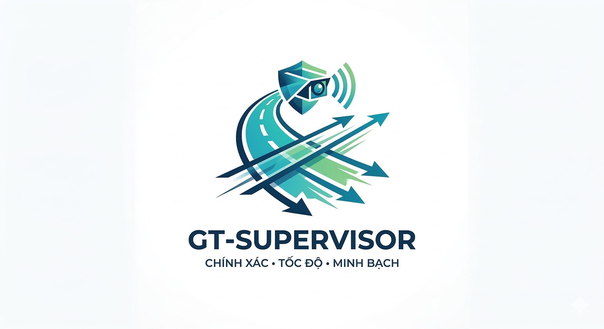

# 🚗 Highway Detection System



Hệ thống giám sát và phân tích giao thông đường cao tốc sử dụng Deep Learning. Hệ thống tích hợp phát hiện đối tượng (YOLO), theo dõi đối tượng (ByteTrack), và phát hiện vi phạm giao thông.

## 📋 Mục lục

- [Tính năng](#-tính-năng)
- [Kiến trúc hệ thống](#-kiến-trúc-hệ-thống)
- [Yêu cầu hệ thống](#-yêu-cầu-hệ-thống)
- [Cài đặt](#-cài-đặt)
- [Release và đóng gói installer](#-release-và-đóng-gói-installer)
- [Hướng dẫn sử dụng](#-hướng-dẫn-sử-dụng)
- [Cấu trúc thư mục](#-cấu-trúc-thư-mục)
- [Tính năng dự kiến](#-tính-năng-dự-kiến)

## ✨ Tính năng

### 1. Phát hiện đối tượng (Object Detection)
- Sử dụng **YOLOv8** để phát hiện phương tiện giao thông
- Hỗ trợ cả định dạng **PyTorch (.pt)** và **ONNX (.onnx)**
- Có thể chọn lọc các loại đối tượng cần theo dõi (ô tô, xe máy, xe tải, v.v.)

### 2. Theo dõi đối tượng (Object Tracking)
- Tích hợp **ByteTrack** thông qua thư viện Supervision
- Theo dõi liên tục các phương tiện qua nhiều frame
- Hiển thị đường di chuyển (trace) của từng phương tiện
- Gán ID duy nhất cho mỗi phương tiện được theo dõi

### 3. Chọn vùng đường (Road Zone Selection)
- Cho phép người dùng vẽ vùng giám sát trên video
- Hỗ trợ chọn **nhiều vùng** đồng thời (multi-zone)
- **Gợi ý tự động** các điểm trên vạch kẻ đường (sử dụng Canny Edge Detection)

### 4. Bird's Eye View (Góc nhìn từ trên xuống)
- Chuyển đổi góc nhìn camera sang góc nhìn từ trên xuống
- Hỗ trợ 2 phương pháp:
  - **IPM (Inverse Perspective Mapping)**: Tự động calibrate từ frame
  - **Homography**: Sử dụng 4 điểm tương ứng
- Hiển thị vị trí phương tiện trên bản đồ BEV real-time

### 5. Phát hiện vi phạm (Violation Detection)
- **Đi sai làn đường (Wrong Lane)**: Phát hiện phương tiện đi ngoài vùng cho phép
- **Phương tiện không hợp lệ (Invalid Vehicle)**: Đánh dấu class không nằm trong danh sách hợp lệ (mặc định: chỉ ô tô)
- Hiển thị cảnh báo trực quan trên video
- Lưu lại lịch sử vi phạm của từng phương tiện

### 6. Giao diện người dùng
- **GUI (PyQt5)**: Giao diện đồ họa thân thiện với người dùng
- **CLI**: Dòng lệnh với nhiều tùy chọn cấu hình
- Hiển thị FPS và thống kê xử lý real-time

## 🏗 Kiến trúc hệ thống

```
┌─────────────────┐     ┌─────────────────┐     ┌─────────────────┐
│   Input Source  │ ──► │  YOLO Detection │ ──► │ ByteTrack       │
│ (Video/Camera)  │     │  (PT/ONNX)      │     │ Tracking        │
└─────────────────┘     └─────────────────┘     └────────┬────────┘
                                                         │
                                                         ▼
┌─────────────────┐     ┌─────────────────┐     ┌─────────────────┐
│  Output Video   │ ◄── │   Visualization │ ◄── │    Violation    │
│  + Statistics   │     │   (BEV + Zones) │     │    Detection    │
└─────────────────┘     └─────────────────┘     └─────────────────┘
```

## 💻 Yêu cầu hệ thống

- **Python**: 3.8+
- **RAM**: 8GB+ khuyến nghị
- **GPU**: NVIDIA CUDA-compatible (tùy chọn, để tăng tốc)
- **Hệ điều hành**: Windows, Linux, macOS

## 📦 Cài đặt

### 1. Clone repository

```bash
git clone https://github.com/your-username/highway_detection.git
cd highway_detection
```

### 2. Tạo môi trường ảo (khuyến nghị)

```bash
# Sử dụng conda
conda create -n highway python=3.10
conda activate highway

# Hoặc sử dụng venv
python -m venv venv
source venv/bin/activate  # Linux/macOS
venv\Scripts\activate     # Windows
```

### 3. Cài đặt dependencies

```bash
pip install -r requirements.txt
```

### 4. (Tùy chọn) Cài đặt CUDA cho GPU

Nếu bạn có GPU NVIDIA và muốn tăng tốc xử lý:

```bash
# Cài đặt PyTorch với CUDA
pip install torch torchvision --index-url https://download.pytorch.org/whl/cu118

# Cài đặt ONNX Runtime GPU
pip install onnxruntime-gpu
```

## 🏷 Release và đóng gói installer

Quy trình phát hành cho Windows gồm 3 bước: build app, stage release, tạo installer bằng Inno Setup.

### 1. Chuẩn bị Inno Setup

- Cài **Inno Setup 6** trên máy build.
- Mặc định script sẽ tự tìm `ISCC.exe` tại:
  - `C:/Program Files (x86)/Inno Setup 6/ISCC.exe`
  - `C:/Program Files/Inno Setup 6/ISCC.exe`
- Nếu bạn cài ở vị trí khác, đặt biến môi trường `INNO_SETUP_ISCC` trỏ tới `ISCC.exe`.

### 2. Quản lý version (semantic versioning)

- Version nguồn được quản lý tại file `VERSION` (ví dụ: `1.0.0`).
- Định dạng bắt buộc: `MAJOR.MINOR.PATCH`.

Gợi ý quy tắc tăng version:
- `MAJOR`: thay đổi lớn, có thể phá tương thích.
- `MINOR`: thêm tính năng nhưng vẫn tương thích.
- `PATCH`: sửa lỗi, không đổi hành vi chính.

### 3. Build và đóng gói release

#### Cách A: chạy liền mạch từ script build

```bash
python scripts/build.py --clean --installer --set-version 1.0.1
```

Lệnh trên sẽ:
1. Build bằng PyInstaller
2. Tạo thư mục phát hành trong `release/app`
3. Cập nhật version
4. Tạo installer vào `release/installer`

#### Cách B: tách từng bước

```bash
# B1: Build
python scripts/build.py --clean

# B2: Stage release (không tạo installer)
python scripts/release.py --set-version 1.0.1

# B3: Tạo installer
python scripts/release.py --installer
```

### 4. Output phát hành

- App đã stage: `release/app`
- Metadata build: `release/release_info.txt`
- Installer: `release/installer/HighwayDetection_<version>_Setup.exe`

### 5. Checklist trước khi gửi người dùng

- Cài thử installer trên máy sạch (không có Python dev env)
- Chạy ứng dụng và mở thử video mẫu
- Kiểm tra model mặc định và thư mục `models/weights`
- Kiểm tra quyền ghi output
- Xác nhận đúng version ở header GUI và tên installer

## 🚀 Hướng dẫn sử dụng

### Sử dụng giao diện GUI

```bash
python run_gui.py
```

Các bước sử dụng GUI:
1. **Chọn nguồn video**: Chọn file video từ máy tính
2. **Cấu hình xử lý**: Chọn model, thiết lập ngưỡng confidence, v.v.
3. **Chọn vùng đường**: Vẽ vùng giám sát trên frame đầu tiên
4. **Xử lý**: Hệ thống sẽ tự động phát hiện, theo dõi và phân tích

### Sử dụng Command Line (CLI)

```bash
# Cơ bản - xử lý video với hiển thị
python main.py --source video --input path/to/video.mp4 --display

# Lưu video output
python main.py --source video --input input.mp4 --output output.mp4 --save-video

# Sử dụng GPU
python main.py --source video --input input.mp4 --device cuda --display

# Tùy chỉnh model và ngưỡng
python main.py --source video --input input.mp4 --model models/weights/best.pt --conf-thres 0.5 --display

# Giảm đổi ID (ReID) với ngưỡng tracking tách riêng
python main.py --source video --input input.mp4 --track-activation-thres 0.4 --track-match-thres 0.72 --display

# Chỉ theo dõi một số loại đối tượng (VD: cars=2, trucks=7)
python main.py --source video --input input.mp4 --classes 2 7 --display

# Tắt Bird's Eye View
python main.py --source video --input input.mp4 --no-bev --display

# Bỏ qua bước chọn vùng đường
python main.py --source video --input input.mp4 --no-select-zone --display

# Bật phát hiện xe không hợp lệ (chỉ cho phép class 2 = Car)
python main.py --source video --input input.mp4 --enable-invalid-vehicle --valid-vehicle-classes 2 --display
```

### Các tham số CLI

| Tham số | Mặc định | Mô tả |
|---------|----------|-------|
| `--source` | video | Loại nguồn: video, webcam, rtsp, images |
| `--input` | input.mp4 | Đường dẫn đến file/URL input |
| `--output` | output.mp4 | Đường dẫn lưu video output |
| `--model` | yolov8n.pt | Đường dẫn đến model YOLO |
| `--device` | cpu | Device: cpu hoặc cuda |
| `--conf-thres` | 0.25 | Ngưỡng confidence |
| `--iou-thres` | 0.5 | Ngưỡng IoU cho detection (NMS) |
| `--track-activation-thres` | 0.4 | Ngưỡng confidence để tạo track mới |
| `--track-match-thres` | 0.7 | Ngưỡng IoU để match detection với track hiện có |
| `--classes` | None | Lọc theo class ID |
| `--enable-bev` | True | Bật Bird's Eye View |
| `--bev-method` | ipm | Phương pháp BEV: ipm hoặc homography |
| `--select-zone` | True | Cho phép chọn vùng đường |
| `--enable-invalid-vehicle` | False | Bật phát hiện phương tiện không hợp lệ |
| `--valid-vehicle-classes` | 2 | Danh sách class ID hợp lệ (không bị đánh dấu vi phạm) |

### Mẹo giảm ReID / ID Switch

- Nếu xe hay bị đổi ID khi cắt nhau: tăng `--track-match-thres` lên 0.75-0.8.
- Nếu xuất hiện nhiều ID ảo: tăng `--track-activation-thres` lên 0.45-0.55.
- Nếu mất track khi bị che khuất ngắn: tăng `--max-age`.
- Nếu dùng `--skip-frames` cao, nên giữ `--max-age` đủ lớn để tránh rớt track sớm.

## 📁 Cấu trúc thư mục

```
highway_detection/
├── main.py                 # Entry point CLI
├── run_gui.py              # Entry point GUI
├── requirements.txt        # Dependencies
├── yolov8n.pt              # Pre-trained YOLO model
│
├── gui/                    # Giao diện người dùng (PyQt5)
│   ├── main_window.py      # Cửa sổ chính
│   ├── config_panel.py     # Panel cấu hình
│   ├── source_selector.py  # Chọn nguồn video
│   ├── zone_selector_widget.py  # Widget chọn vùng
│   └── styles.py           # CSS styles
│
├── models/                 # Model handlers
│   ├── loader.py           # Factory loader
│   ├── pt_handler.py       # PyTorch model handler
│   ├── onnx_handler.py     # ONNX model handler
│   └── weights/            # Thư mục chứa model weights
│
├── process/                # Xử lý video
│   ├── video.py            # Video processor chính
│   └── fps_counter.py      # Đếm FPS
│
├── tracking/               # Theo dõi đối tượng
│   ├── bytetrack.py        # ByteTrack implementation
│   └── export_yolo.py      # Export detections
│
├── lane_mapping/           # Xử lý làn đường
│   ├── road_zone.py        # Chọn và quản lý vùng đường
│   └── bird_eye_view.py    # Chuyển đổi BEV
│
├── violations/             # Phát hiện vi phạm
│   └── detector.py         # Violation detector
│
├── outputs/                # Thư mục lưu kết quả
└── tests/                  # Unit tests
```

## 🔮 Tính năng dự kiến

Các tính năng đang được phát triển:

- [ ] **Webcam Processing**: Xử lý video trực tiếp từ webcam
- [ ] **RTSP Streaming**: Hỗ trợ luồng video RTSP từ camera IP
- [ ] **Speeding Detection**: Phát hiện vượt quá tốc độ cho phép  
- [ ] **Stop Line Violation**: Phát hiện vượt vạch dừng
- [ ] **Unallowed Vehicle**: Phát hiện các phương tiện không hợp lệ
- [ ] **Export Report**: Xuất báo cáo vi phạm (PDF/Excel)
- [ ] **Database Integration**: Lưu trữ dữ liệu vi phạm vào database
